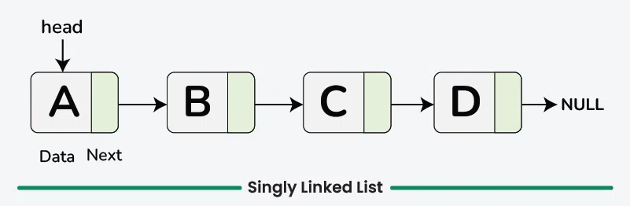
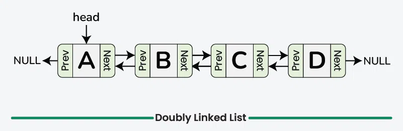
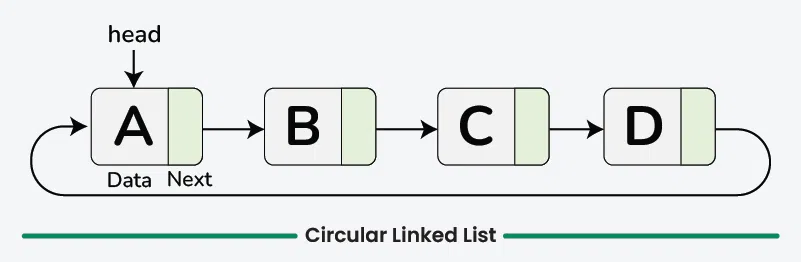
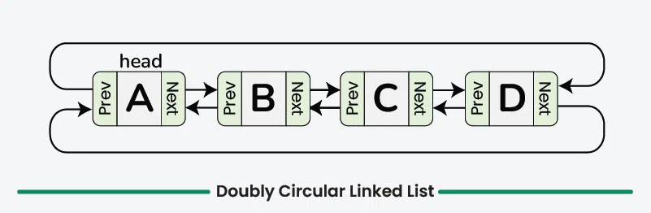

## 1. A singly linked list is a type of linked list where each node contains two parts:

- Data: The value stored in the node.
- Next Pointer: A pointer to the next node in the list

### Visual Representation:

```py
[Data | Next] -> [Data | Next] -> [Data | Next] -> NULL
```

- Data: The value of the node.
- Next: A pointer to the next node in the list.
- The last node's Next pointer is NULL (indicating the end of the list).



---

## 2. A doubly linked list is a more flexible type of linked list where each node contains:

- Data: The value stored in the node.
- Previous Pointer (Prev): A pointer to the previous node.
- Next Pointer (Next): A pointer to the next node.

In a doubly linked list, you can traverse in both directions (forward and backward).

### Visual Representation:

```py
NULL <- [Prev | Data | Next] <-> [Prev | Data | Next] <-> [Prev | Data | Next] -> NULL
```

- Each node has a Prev pointer to the previous node and a Next pointer to the next node.
- The first node’s Prev pointer is NULL, and the last node’s Next pointer is NULL.



---

## 3. A circular linked list is a type of linked list in which all nodes are connected to form a circle. Unlike a regular linked list:

1. ### Singly Circular Linked List :

   - Each node has a Next pointer to the next node, and the Next pointer of the last node points back to the first node.

   ```powershell
   [Data | Next] -> [Data | Next] -> [Data | Next]
       ^---------------------------------------^
   ```

   

2. ### Doubly Circular Linked List:
   - Each node has both Prev and Next pointers, and the last node's Next points to the first node while the first node's Prev points to the last node.
   - ### Key Features
     - The list doesn't have a NULL pointer at either end.
     - It enables continuous traversal through the list in a circular fashion.
   ```powershell
   [Prev | Data | Next] <-> [Prev | Data | Next] <-> [Prev | Data | Next]
    ^-------------------------------------------------------------^
   ```
   
